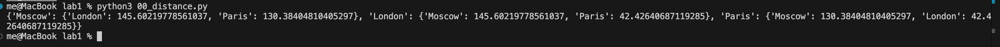
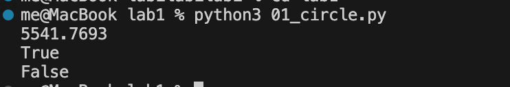
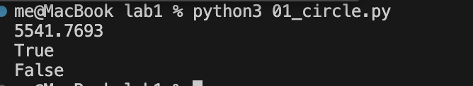
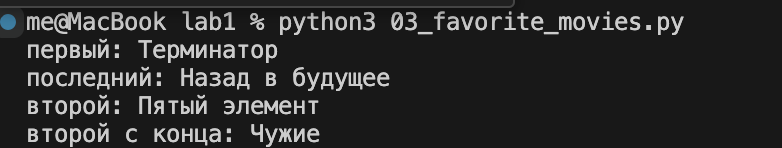

# 00_distance.py
## Составить словарь словарей расстояний между ними
### INPUT

```python
sites = {
    'Moscow': (550, 370),
    'London': (510, 510),
    'Paris': (480, 480),
}
```

### OUTPUT 
```python
distances = {}
```

### Выполнение задачи
Нам нужно пройтись по словарю sites, получая названия городов и их координаты, затем мы берем x1 y1 и x2 y2 координаты двух городов и высчитываем по формуле ((x1 - x2) ** 2 + (y1 - y2) ** 2) ** 0.5 их расстояние. 
Так как нам нужно обрабатывать два города, мы создаем два цикла for, которые проходятся по словарю.

### Решение
```python
for name_1, coords_1 in sites.items():
    distances[name_1] = {}
    for name_2, coords_2 in sites.items():
        if name_1 != name_2:
            x1 = coords_1[0]
            y1 = coords_1[1]
            x2 = coords_2[0]
            y2 = coords_2[1]
            distances[name_1][name_2] = ((x1 - x2) ** 2 + (y1 - y2) ** 2) ** 0.5
```

### Вывод программы


# 01_circle.py
## Задание 1. Выведите на консоль значение прощади этого круга с точностю до 4-х знаков после запятой.
### INPUT
```python
radius = 42
```
### OUTPUT
```python
print(round(3.1415926 * (radius ** 2), 4))
```

### Выполнение задачи
Формула для подсчета площади круга = Pi * R^2
После подсчета, округялем значение.

### Решение
```python
print(round(3.1415926 * (radius ** 2), 4))
```

### Вывод программы

## Задание 2. Если точка point лежит внутри того самого круга [центр в начале координат (0, 0), radius = 42], то выведите на консоль True, Или False, если точка лежит вовне круга.
### INPUT
```python
point_1 = (23, 34)
point_2 = (30, 30)
```
### OUTPUT
```python
point_in_1 = (point_1[0]**2 + point_1[1]**2)**0.5
point_in_2 = (point_2[0]**2 + point_2[1]**2)**0.5
```

### Выполнение задачи
Мы определяем расстояние от точки до начала координат, затем сверяем попадает ли она в наш радиус или нет.
### Решение
```python
print(point_in_1 <= radius)
print(point_in_2 <= radius)
```
### Вывод программы


# 02_operations.py
## Расставьте знаки операций "плюс", "минус", "умножение" и скобки между числами "1 2 3 4 5" так, что бы получилось число "25".
### Решение
```python
result = 1 * (2 + 3) * 4 + 5
print(result)
```
### Вывод программы


# 03_favorite_movies.py
## Выведите на консоль с помощью индексации строки, последовательно: первый фильм, последний, второй, второй с конца.
### INPUT
```python
my_favorite_movies = 'Терминатор, Пятый элемент, Аватар, Чужие, Назад в будущее'
```

### OUTPUT
```python
first_film = my_favorite_movies[0:10]
last_film = my_favorite_movies[42:60]
second_film = my_favorite_movies[12:25]
second_from_end_film = my_favorite_movies[35:40]
```

### Выполнение задачи
В данной задаче мы можем использовать только срезы. Цифра **x** в [x:y] означает начало среза, **y** означает конец среза. Срез идет посимвольно.

### Решение
```python
first_film = my_favorite_movies[0:10]
last_film = my_favorite_movies[42:60]
second_film = my_favorite_movies[12:25]
second_from_end_film = my_favorite_movies[35:40]

print(f'первый: {first_film}\nпоследний: {last_film}\nвторой: {second_film}\nвторой с конца: {second_from_end_film}')
```

### Вывод программы
