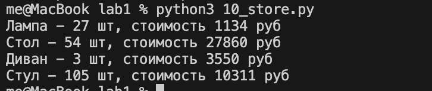

# 00_distance.py
## Составить словарь словарей расстояний между ними
### INPUT

```python
sites = {
    'Moscow': (550, 370),
    'London': (510, 510),
    'Paris': (480, 480),
}
```

### OUTPUT 
```python
distances = {}
```

### Выполнение задачи
Нам нужно пройтись по словарю sites, получая названия городов и их координаты, затем мы берем x1 y1 и x2 y2 координаты двух городов и высчитываем по формуле ((x1 - x2) ** 2 + (y1 - y2) ** 2) ** 0.5 их расстояние. 
Так как нам нужно обрабатывать два города, мы создаем два цикла for, которые проходятся по словарю.

### Решение
```python
for name_1, coords_1 in sites.items():
    distances[name_1] = {}
    for name_2, coords_2 in sites.items():
        if name_1 != name_2:
            x1 = coords_1[0]
            y1 = coords_1[1]
            x2 = coords_2[0]
            y2 = coords_2[1]
            distances[name_1][name_2] = ((x1 - x2) ** 2 + (y1 - y2) ** 2) ** 0.5
```

### Вывод программы


# 01_circle.py
## Задание 1. Выведите на консоль значение прощади этого круга с точностю до 4-х знаков после запятой.
### INPUT
```python
radius = 42
```
### OUTPUT
```python
print(round(3.1415926 * (radius ** 2), 4))
```

### Выполнение задачи
Формула для подсчета площади круга = Pi * R^2
После подсчета, округялем значение.

### Решение
```python
print(round(3.1415926 * (radius ** 2), 4))
```

### Вывод программы

## Задание 2. Если точка point лежит внутри того самого круга [центр в начале координат (0, 0), radius = 42], то выведите на консоль True, Или False, если точка лежит вовне круга.
### INPUT
```python
point_1 = (23, 34)
point_2 = (30, 30)
```
### OUTPUT
```python
point_in_1 = (point_1[0]**2 + point_1[1]**2)**0.5
point_in_2 = (point_2[0]**2 + point_2[1]**2)**0.5
```

### Выполнение задачи
Мы определяем расстояние от точки до начала координат, затем сверяем попадает ли она в наш радиус или нет.
### Решение
```python
print(point_in_1 <= radius)
print(point_in_2 <= radius)
```
### Вывод программы


# 02_operations.py
## Расставьте знаки операций "плюс", "минус", "умножение" и скобки между числами "1 2 3 4 5" так, что бы получилось число "25".
### Решение
```python
result = 1 * (2 + 3) * 4 + 5
print(result)
```
### Вывод программы


# 03_favorite_movies.py
## Выведите на консоль с помощью индексации строки, последовательно: первый фильм, последний, второй, второй с конца.
### INPUT
```python
my_favorite_movies = 'Терминатор, Пятый элемент, Аватар, Чужие, Назад в будущее'
```

### OUTPUT
```python
first_film = my_favorite_movies[0:10]
last_film = my_favorite_movies[42:60]
second_film = my_favorite_movies[12:25]
second_from_end_film = my_favorite_movies[35:40]
```

### Выполнение задачи
В данной задаче мы можем использовать только срезы. Цифра **x** в [x:y] означает начало среза, **y** означает конец среза. Срез идет посимвольно.

### Решение
```python
first_film = my_favorite_movies[0:10]
last_film = my_favorite_movies[42:60]
second_film = my_favorite_movies[12:25]
second_from_end_film = my_favorite_movies[35:40]

print(f'первый: {first_film}\nпоследний: {last_film}\nвторой: {second_film}\nвторой с конца: {second_from_end_film}')
```

### Вывод программы


# 04_my_family.py
## Выведите на консоль рост отца в формате "Рост отца - ХХ см".
### INPUT
```python
my_family = ['Мама', 'Папа', 'Сестра']
my_family_height = [
    ['Мама', 160],
    ['Папа', 171],
    ['Сестра', 140],
]
```

### OUTPUT
```python
print(f"Рост отца - {my_family_height[1][1]} см")
```

### Выполнение задачи
Нам нужно составить два списка, в первом списке - наша семья, в другом их соответствие с ростом. Затем нам нужно вычленить отца и найти его рост.

### Решение
```python
print(f"Рост отца - {my_family_height[1][1]} см")
```

### Вывод программы

## Выведите на консоль общий рост вашей семьи как сумму ростов всех членов.
### INPUT
```python
my_family = ['Мама', 'Папа', 'Сестра']
my_family_height = [
    ['Мама', 160],
    ['Папа', 171],
    ['Сестра', 140],
]
```
### OUTPUT
```python
print(f"Общий рост моей семьи - {amount} см")
```

### Выполнение задачи
Нам нужно пройтись по списку my_family_height и сложить все росты в переменную amount.

### Решение
```python
amount = 0
for people in my_family_height:
    amount += people[1]
```
### Вывод программы


# 05_zoo.py
## Задание 1. Посадите медведя (bear) между львом и кенгуру.
### INPUT
```python
zoo = ['lion', 'kangaroo', 'elephant', 'monkey', ]
```
### OUTPUT
```python
zoo = ['lion', 'bear' ,'kangaroo', 'elephant', 'monkey', ]
```

### Выполнение задачи
Используем встроенный метод работы со списками **insert**. Первый аргумент задает позицию.

### Решение
```python
zoo.insert(1, 'bear')
```

### Вывод программы

## Задание 2. Добавьте птиц из списка birds в последние клетки зоопарка.
### INPUT
```python
zoo = ['lion', 'bear' ,'kangaroo', 'elephant', 'monkey', ]
birds = ['rooster', 'ostrich', 'lark', ]
```
### OUTPUT
```python
zoo = ['lion', 'bear', 'kangaroo', 'elephant', 'monkey', 'rooster', 'ostrich', 'lark']
```

### Выполнение задачи
Используем встроенный метод работы со списками **extend**.

### Решение
```python
zoo.extend(birds)
```

### Вывод программы


## Задание 3. Убрать слона.
### INPUT
```python
zoo = ['lion', 'bear', 'kangaroo', 'elephant', 'monkey', 'rooster', 'ostrich', 'lark']
```

### OUTPUT
```python
zoo = ['lion', 'bear', 'kangaroo', 'monkey', 'rooster', 'ostrich', 'lark']
```

### Выполнение задачи
Используем встроенный метод работы со списками **remove**.
### Решение
```python
zoo.remove('elephant')
```
### Вывод программы

## Задание 4. Вывести номера клеток льва и жаворонка.
### INPUT
```python
zoo = ['lion', 'bear', 'kangaroo', 'monkey', 'rooster', 'ostrich', 'lark']
```
### Выполнение задачи
Используем встроенный метод работы со списками **index**. Добавляем единицу, так как номера при выводе должны быть понятны простому человеку, не программисту.

### Решение
```python
print(f"В клетке {zoo.index('lion') + 1} сидит лев")
print(f"В клетке {zoo.index('lark') + 1} сидит жаворонок")
```

### Вывод программы 


# 06_songs_list.py
## Задание 1. Распечатайте общее время звучания трех песен: 'Halo', 'Enjoy the Silence' и 'Clean' в формате "Три песни звучат ХХХ.XX минут".
### INPUT
```python
violator_songs_list = [
    ['World in My Eyes', 4.86],
    ['Sweetest Perfection', 4.43],
    ['Personal Jesus', 4.56],
    ['Halo', 4.9],
    ['Waiting for the Night', 6.07],
    ['Enjoy the Silence', 4.20],
    ['Policy of Truth', 4.76],
    ['Blue Dress', 4.29],
    ['Clean', 5.83],
]
```
### Выполнение задачи
Мы имеем список, состоящий из названия песни и ее продолжительности в минутах. Нам нужно посчитать время звучания трех песен. Для этого мы проходимся по списку, ищем нужные песни и их время суммируем в переменную amount.

### Решение
```python
amount = 0.0
for song in violator_songs_list:
    if song[0] in ['Halo', 'Enjoy the Silence', 'Clean']:
        amount += song[1]

amount = round(amount, 2)
print(f"Три песни звучат {amount} минут")
```
### Вывод программы

## Задание 2. Распечатайте общее время звучания трех песен: 'Sweetest Perfection', 'Policy of Truth' и 'Blue Dress'
### INPUT
```python
violator_songs_dict = {
    'World in My Eyes': 4.76,
    'Sweetest Perfection': 4.43,
    'Personal Jesus': 4.56,
    'Halo': 4.30,
    'Waiting for the Night': 6.07,
    'Enjoy the Silence': 4.6,
    'Policy of Truth': 4.88,
    'Blue Dress': 4.18,
    'Clean': 5.68,
}
```
### Выполнение задачи
Мы имеем словарь с названиями песен и их длительностью в формате ключ:значение. Мы проходимся по списку и ищем ключи, которые подходят под наше условие т.е 'Sweetest Perfection', 'Policy of Truth' и 'Blue Dress'. Берем длительность звучания и суммируем в переменную amount.

### Решение
```python
amount = 0.0

for k, v in violator_songs_dict.items():
    if k in ['Sweetest Perfection', 'Policy of Truth', 'Blue Dress']:
        amount += v

amount = round(amount)
```

### Вывод программы

# 07_secret.py
## Задание 1. Нужно его расшифровать и вывести на консоль в удобочитаемом виде.
### INPUT
```python
secret_message = [
    'квевтфпп6щ3стмзалтнмаршгб5длгуча',
    'дьсеы6лц2бане4т64ь4б3ущея6втщл6б',
    'т3пплвце1н3и2кд4лы12чф1ап3бкычаь',
    'ьд5фму3ежородт9г686буиимыкучшсал',
    'бсц59мегщ2лятьаьгенедыв9фк9ехб1а',
]
```
### OUTPUT
```bash
в бане веник дороже денег
```

### Выполнение задачи
У нас есть описание ключа для расшифровки этого сообщения. Всего у нас 5 слов, каждое слово в каждом элементе списка. Используем срезы.

### Решение
```python
word1 = secret_message[0][3]
word2 = secret_message[1][9:13]
word3 = secret_message[2][5:15:2]
word4 = secret_message[3][7:13][::-1]
word5 = secret_message[4][16:21][::-1]
```

### Вывод программы

# 08_garnden.py
## Задание 1. Создайте множество цветов, произрастающих в саду и на лугу.
### INPUT
```python
garden = ('ромашка', 'роза', 'одуванчик', 'ромашка', 'гладиолус', 'подсолнух', 'роза', )
meadow = ('клевер', 'одуванчик', 'ромашка', 'клевер', 'мак', 'одуванчик', 'ромашка', )
```

### Выполнение задачи
Воспользуемся встроенным методом преобрзования **set**.

### Решение
```python
garden_set = set(garden)
meadow_set = set(meadow)
```

## Задание 2. Вывести цветы используя операции для работы с множествами.
### Выполнение задачи
Мы воспользуемся операциями, такими как &, -, |.

### Решение
```python
print(garden_set | meadow_set) # выведите на консоль все виды цветов
print(garden_set & meadow_set) # выведите на консоль те, которые растут и там и там
print(garden_set - meadow_set) # выведите на консоль те, которые растут в саду, но не растут на лугу
print(meadow_set - garden_set) # выведите на консоль те, которые растут на лугу, но не растут в саду
```

### Вывод программы

# 09_shopping.py
## Задание 1. Создайте словарь цен на продкты следующего вида (писать прямо в коде).
### INPUT
```python
shops = {
    'ашан':
        [
            {'name': 'печенье', 'price': 10.99},
            {'name': 'конфеты', 'price': 34.99},
            {'name': 'карамель', 'price': 45.99},
            {'name': 'пирожное', 'price': 67.99}
        ],
    'пятерочка':
        [
            {'name': 'печенье', 'price': 9.99},
            {'name': 'конфеты', 'price': 32.99},
            {'name': 'карамель', 'price': 46.99},
            {'name': 'пирожное', 'price': 59.99}
        ],
    'магнит':
        [
            {'name': 'печенье', 'price': 11.99},
            {'name': 'конфеты', 'price': 30.99},
            {'name': 'карамель', 'price': 41.99},
            {'name': 'пирожное', 'price': 62.99}
        ],
}
```
### OUTPUT
```python
sweets = {}
```

### Выполнение задачи
Словарь ключ:значение. Проходимся по всем магазинам и товарам в них. Добавляем в новый, но делим по категориям **товаров**.

### Решение
```python
for name, tovar in shops.items():
    for t in tovar:
        if t['name'] not in sweets:
            sweets[t['name']] = []
        sweets[t['name']].append({"shop": name, "price": t['price']})
```
## Задание 2. Указать надо только по 2 магазина с минимальными ценами
### Решение
```python
for shop, shoplist in sweets.items():
    shoplist.sort(key=lambda x: x['price'])
    print(shoplist[1:2])
```

### Вывод программы

# 10_store.py
## Задание 1. Вывести стоимость каждого вида товара на складе: один раз распечать сколько всего столов и их общая стоимость, один раз распечать сколько всего стульев и их общая стоимость.
### INPUT
```python
goods = {
    'Лампа': '12345',
    'Стол': '23456',
    'Диван': '34567',
    'Стул': '45678',
}

store = {
    '12345': [
        {'quantity': 27, 'price': 42},
    ],
    '23456': [
        {'quantity': 22, 'price': 510},
        {'quantity': 32, 'price': 520},
    ],
    '34567': [
        {'quantity': 2, 'price': 1200},
        {'quantity': 1, 'price': 1150},
    ],
    '45678': [
        {'quantity': 50, 'price': 100},
        {'quantity': 12, 'price': 95},
        {'quantity': 43, 'price': 97},
    ],
}
```
### Ограничения
Циклы использовать нельзя.

### Решение
```python
##
decks_q_a = store[goods['Стол']][0]['quantity']
decks_q_b = store[goods['Стол']][1]['quantity']
decks_cost_a = decks_q_a * store[goods['Стол']][0]['price']
decks_cost_b = decks_q_b * store[goods['Стол']][1]['price']

print("Стол -", decks_q_a + decks_q_b, 'шт, стоимость', decks_cost_a + decks_cost_b, 'руб')
##
divan_q_a = store[goods['Диван']][0]['quantity']
divan_q_b = store[goods['Диван']][1]['quantity']
divan_cost_a = divan_q_a * store[goods['Диван']][0]['price']
divan_cost_b = divan_q_b * store[goods['Диван']][1]['price']

print("Диван -", divan_q_a + divan_q_b, 'шт, стоимость', divan_cost_a + divan_cost_b, 'руб')
##
stul_q_a = store[goods['Стул']][0]['quantity']
stul_q_b = store[goods['Стул']][1]['quantity']
stul_q_c = store[goods['Стул']][2]['quantity']
stul_cost_a = stul_q_a * store[goods['Стул']][0]['price']
stul_cost_b = stul_q_b * store[goods['Стул']][1]['price']
stul_cost_c = stul_q_c * store[goods['Стул']][2]['price']

print("Стул -", stul_q_a + stul_q_b + stul_q_c, 'шт, стоимость', stul_cost_a + stul_cost_b + stul_cost_c, 'руб')
```

### Вывод программы
